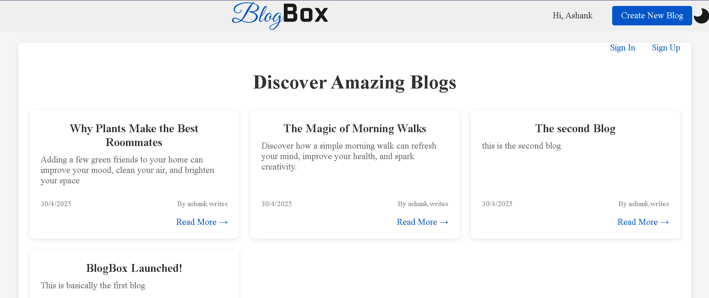
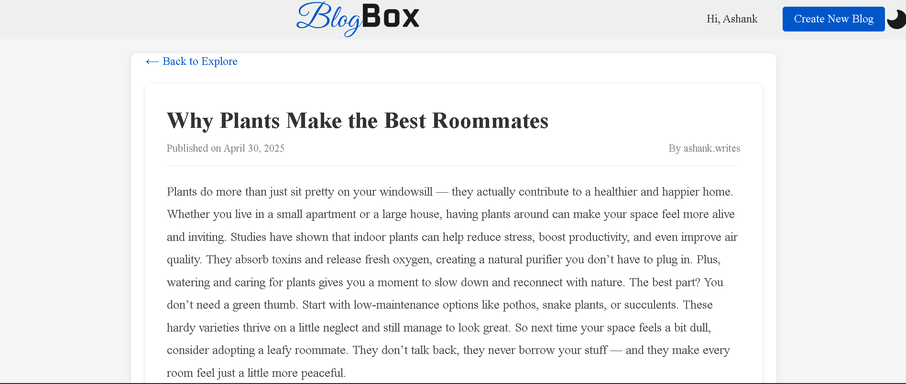
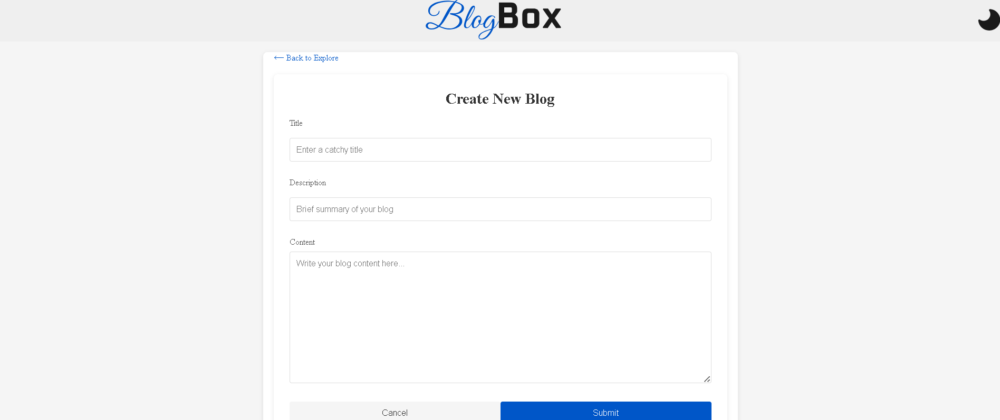
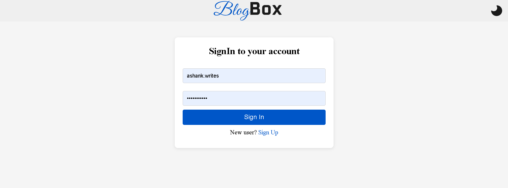
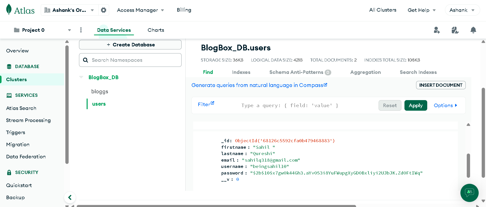
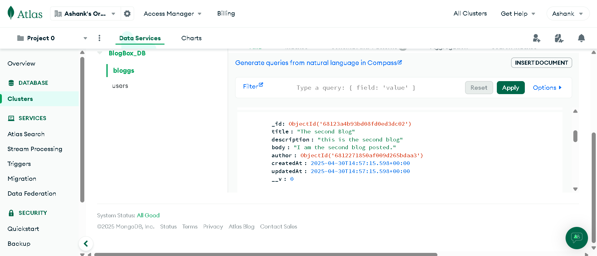

# BlogBox

A modern, responsive blogging platform built with Node.js, Express, and MongoDB.


## Features

- **User Authentication**: Secure signup and signin functionality
- **Blog Management**: Create, read, update, and delete blog posts
- **Responsive Design**: Works on desktop and mobile devices
- **Theme Toggle**: Switch between light and dark themes
- **Markdown Support**: Write blog posts with rich formatting
- **User-friendly Interface**: Clean and intuitive design

## Technologies Used

- **Frontend**: HTML, CSS, JavaScript, EJS templates
- **Backend**: Node.js, Express
- **Database**: MongoDB with Mongoose ODM
- **Authentication**: JWT (JSON Web Tokens)
- **Other**: Bcrypt for password hashing

## Installation

1. Clone the repository:
   ```bash
   git clone https://github.com/Ashankshukla25/BlogBox.git
   cd BlogBox
   ```

2. Install dependencies:
   ```bash
   npm install
   ```

3. Create a `.env` file in the root directory with the following variables:
   ```
   MONGODB_URI=your_mongodb_connection_string
   JWT_SECRET=your_jwt_secret_key
   PORT=3000
   ```

4. Start the development server:
   ```bash
   node app.js
   ```

5. Open your browser and navigate to `http://localhost:3000`

## Usage

### User Authentication

- Create a new account via the signup page
- Log in with your credentials
- User sessions are maintained using JWT tokens stored in localStorage

### Creating and Reading Blogs

- View all blogs on the explore page
- Click "Create New Blog" to write a new post (login required)
- Click on a blog to view its complete content
- Navigate back to the explore page using the back button

## API Endpoints

### Authentication
- `POST /auth/signup`: Register a new user
- `POST /auth/signin`: Authenticate user and receive JWT token

### Blogs
- `GET /blogs`: Get all blogs
- `GET /blogs/:id`: Get a specific blog
- `POST /blogs`: Create a new blog (requires authentication)
- `PUT /blogs/:id`: Update a blog (requires authentication)
- `DELETE /blogs/:id`: Delete a blog (requires authentication)

## Project Structure

```
BlogBox/
├── models/          # Database models
├── public/          # Static assets
│   └── assets/      # Images and icons
├── routes/          # API routes
├── views/           # EJS templates
│   └── partials/    # Reusable template parts
├── app.js           # Main application file
├── package.json     # Project dependencies
└── README.md        # Project documentation
```

## Screenshots


### Explore Page

*Browse through all available blog posts on the responsive explore page*

### Blog Detail View

*Read the full content of blogs with author information and publication date*

### Create New Blog

*Write and publish new blog posts with a clean, intuitive interface*

### User Authentication

*Secure signup and signin functionality with form validation*

### Mongo DB


*Database view*

## License

This project is licensed under the MIT License - see the LICENSE file for details.

## Author

- **Ashank Shukla** - [GitHub Profile](https://github.com/Ashankshukla25)

## Acknowledgments

- The Node.js and Express communities for excellent documentation
